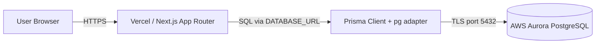
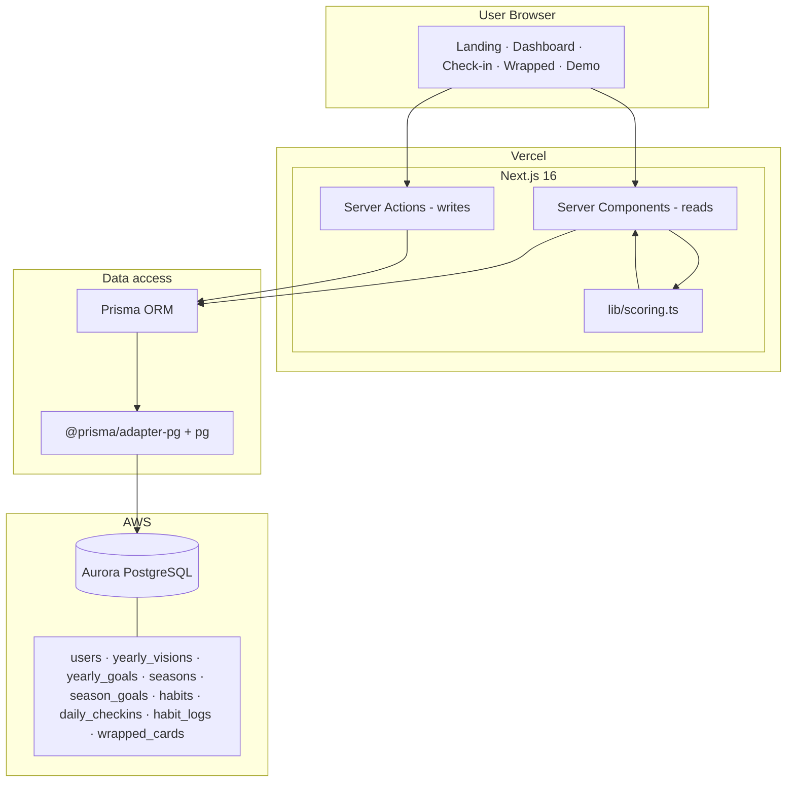
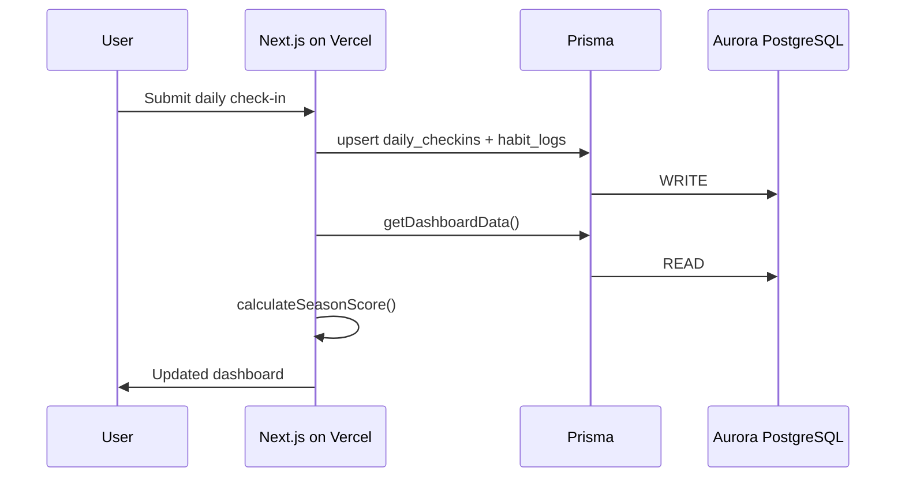

# Becoming — Architecture Diagram (Submission)

**Live app:** https://becoming-nine.vercel.app

Use the diagram below for hackathon submission. Export as PNG via [mermaid.live](https://mermaid.live) (paste code → Actions → Export PNG).

---

## Simple flow (required for submission)

---

## Detailed architecture

---

## Data flow (check-in example)

---

## How to export PNG for submission

1. Go to **https://mermaid.live**
2. Copy one of the `mermaid` code blocks above (start at `flowchart` / `sequenceDiagram`, no backticks)
3. Paste into the editor
4. **Actions → Export PNG** (or SVG)
5. Upload to hackathon form

**Alternative:** Open this file on GitHub — Mermaid renders in the README preview. Screenshot the rendered diagram.

Full version with extra detail: [`architecture-diagram.md`](./architecture-diagram.md)

---

## Text summary (if the form has a description field)

Becoming runs as a Next.js 16 app on Vercel. The browser talks to Server Components (dashboard, wrapped) and Server Actions (check-in, demo seed). Prisma ORM with the PostgreSQL driver adapter connects over TLS to AWS Aurora PostgreSQL, which stores users, visions, seasons, habits, daily check-ins, habit logs, and wrapped cards. Custom scoring logic in `lib/scoring.ts` computes season scores and recap cards from live database reads.
