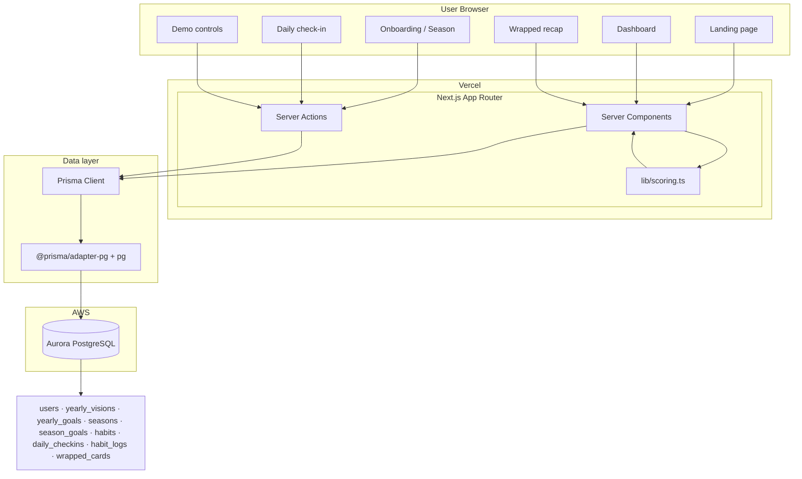
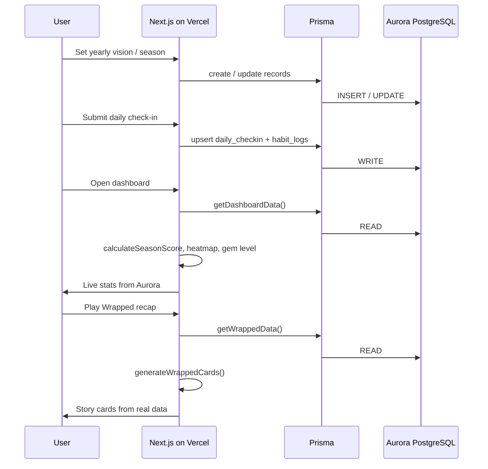

# Becoming — Architecture Diagram

Use this for hackathon submission. Export the Mermaid diagram as PNG from [mermaid.live](https://mermaid.live) or screenshot from GitHub preview.

## System overview

## Core product loop

## Stack summary

| Layer | Technology |
|-------|------------|
| Frontend | Next.js 16, React 19, TypeScript, Tailwind, shadcn/ui |
| Hosting | Vercel |
| API / mutations | Server Components + Server Actions |
| ORM | Prisma 7 |
| Database driver | `@prisma/adapter-pg` + `pg` (TLS to Aurora) |
| Database | AWS Aurora PostgreSQL |
| Business logic | `lib/scoring.ts` (season score, gem, heatmap, wrapped) |

## Environment

- `DATABASE_URL` — Aurora connection string (`.env.local` locally, Vercel env in production)
- Security group must allow PostgreSQL `5432` from Vercel (demo: `0.0.0.0/0` temporarily)
